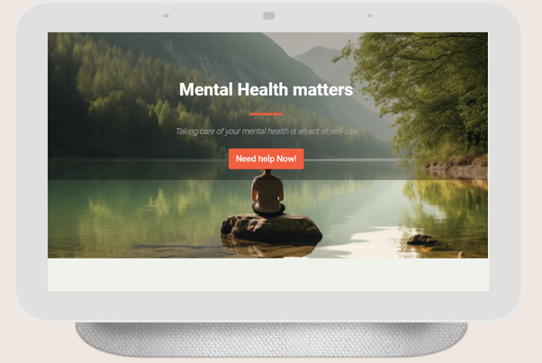

# MentalHealth-M
Mental Health Awareness Web Page

 

Project Overview

This web page is designed to provide users with easy access to mental health resources, including self-help tools, tips, affirmations, and ways to get professional help. The site was built with user experience (UX) as a core focus, ensuring that the layout is clear, visually appealing, and simple to navigate.

Features

1. Hero Section

Description: A large hero image that captures the essence of mental health and well-being. The hero section is visually engaging and serves as the first impression for visitors.

Purpose: The hero section includes a “Need Help Now!” button, which directs users immediately to resources and contact form for professional assistance.

UX Consideration: By placing an eye-catching image and a prominent call-to-action button ("Need Help Now!") in the hero section, users are encouraged to take the next step in seeking support with minimal effort.

2. Mental Health warning signs Tests and Tips (Cards Section)

Description: The web page includes cards that provide  warning signs, mental health tests and tips to help users evaluate their mental state and learn self-care strategies.

warning signs of mental illness : Short description of early warning signs of mental disorder.

Mental Health Tests: Quick and easy-to-take mental health quizzes that provide users with personal insight into their current emotional or psychological well-being.

Mental Health Tips: Short, digestible advice on improving mental health, self-care, and managing stress.

UX Consideration: Cards are used for their simplicity and ease of scanning, allowing users to quickly access critical content without feeling overwhelmed. Each card has a brief description and a clickable link for more detailed information.

3. Affirmations Block

Description: A dedicated block with positive affirmations to encourage mindfulness and mental wellness. These affirmations aim to uplift users and help promote positive thinking.

Newsletter Subscription: Allow users to subscribe for weekly affirmations or mental health tips delivered via email.

UX Consideration: Affirmations are carefully curated to be supportive and non-intrusive. Their placement is designed to give users a moment of calm as they navigate the page.

4. Footer Section

Description: The footer contains essential  social media links.

UX Consideration: The footer is minimalist and informative, ensuring that essential navigation options are easily accessible but do not overwhelm the user. All links are clearly labeled and well-placed for quick access.

User Experience (UX) Design Principles

1. Accessibility:

Fonts, colors, and contrast are carefully selected to ensure readability for all users, including those with visual impairments. The page is mobile-friendly and responsive across different devices.

2. Simple and Intuitive Navigation:

The page is designed with clear, intuitive navigation so users can quickly find what they need without feeling lost. The use of buttons and cards enhances usability.

3. Emotional Support Through Design:

Visual elements (hero image, affirmations) and content are purposefully chosen to create a calming environment. The goal is to reduce any stress or anxiety associated with seeking mental health support.

4. Action-Oriented:

The "Need Help Now!" button, prominently displayed in the hero section, encourages users to take immediate action if needed. This design choice is based on the idea that users seeking mental health resources should be able to access support quickly and without barriers.

5. Concise and Focused Content:

Each section provides clear, actionable information. Users are not overwhelmed with lengthy text or unnecessary content, which helps maintain focus on what's important: getting help, learning mental health strategies, and finding encouragement.

Future Enhancements

Expand Mental Health Test Options: Provide more in-depth and varied tests for different mental health conditions.

Interactive Elements: Add more interactive features like a chatbot for mental health advice or a live chat support function.

References : 

1.ChatGPT help to structure the readme content

2.https://github.com/TaylaJBall/Minds-Together inspired from the cards sections

